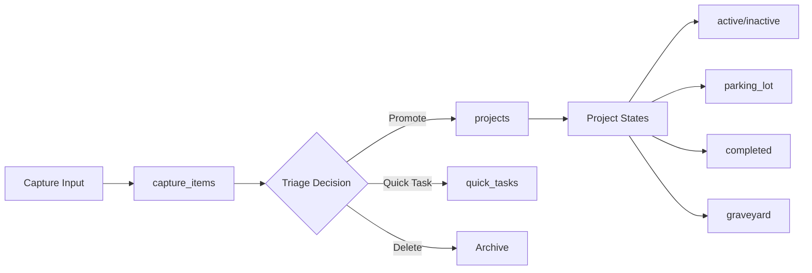
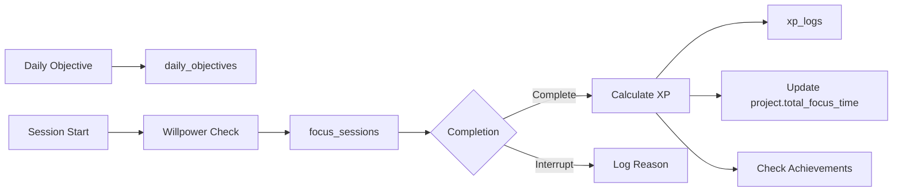

# Data Model Validation Plan

## Executive Summary
This document validates the data model's ability to support the complete user journey from Strategic Map and Deep Focus through to Analytics visualizations. It identifies gaps, tests coherence through user flows, and provides recommendations for ensuring data integrity.

**UPDATE**: All critical issues have been resolved. See `schema-complete.sql` for the corrected schema and `validation-tests.md` for validation results.

## 1. Data Model Analysis

### 1.1 Current Schema Review

#### ✅ Well-Defined Tables
- **capture_items**: Properly tracks capture source, triage decisions, and timestamps
- **projects**: Comprehensive project tracking with cost/benefit, status lifecycle, and categories
- **focus_sessions**: Detailed session metrics including willpower, energy, and completion status
- **xp_logs**: Proper tracking of XP with multipliers and weekly aggregation
- **daily_objectives**: Clear structure for daily commitments

#### ⚠️ Missing or Incomplete Elements

| Table | Missing Field | Impact | Priority |
|-------|--------------|--------|----------|
| focus_sessions | quality_rating | Cannot generate "Session Quality Trends" in Analytics | HIGH |
| projects | weekly_active_start | Cannot track "Projects Completed this Week" accurately | HIGH |
| focus_sessions | session_number_today | Cannot calculate daily XP decay (1st=100%, 2nd=75%, etc.) | HIGH |
| achievements | progress_data | Cannot track progress toward achievements | MEDIUM |
| achievements | category | Cannot group achievements by type | MEDIUM |
| projects | actual_completion_date | completed_at might be graveyard date, not completion | MEDIUM |
| capture_items | project_id | Cannot link triaged items to created projects | LOW |

### 1.2 Relationship Integrity Issues

#### Critical Relationships
- ✅ **focus_sessions → projects**: Properly referenced
- ✅ **focus_sessions → daily_objectives**: Properly referenced
- ✅ **xp_logs → source_id**: Flexible reference (can be session or project)
- ⚠️ **capture_items → projects**: No link when item becomes project
- ⚠️ **achievements → focus_sessions**: No tracking of which sessions contributed

### 1.3 Data Type Concerns

| Issue | Location | Current | Recommended |
|-------|----------|---------|-------------|
| Difficulty calculation | focus_sessions.difficulty_score | INTEGER | Should be derived from willpower + duration |
| Week number | xp_logs.week_number | INTEGER | Needs timezone consideration (Brussels) |
| Time of day | focus_sessions.time_of_day | VARCHAR(20) | Should be calculated from started_at |
| Session duration | daily_objectives.session_duration | VARCHAR(10) | Should be INTEGER or allow array |

## 2. Data Flow Mapping

### 2.1 Strategic Map → Database Flow



**Data Captured:**
- ✅ Capture timestamp and source
- ✅ Triage decision and timestamp
- ✅ Project creation with all fields
- ⚠️ No link between capture_item and resulting project
- ⚠️ No tracking of project state transitions

### 2.2 Deep Focus → Database Flow



**Data Captured:**
- ✅ Daily objective with session count and duration
- ✅ Willpower level at start
- ✅ Energy level at end
- ✅ Actual vs planned duration
- ⚠️ No session quality rating
- ⚠️ No daily session sequence number for XP decay

### 2.3 Analytics Data Requirements

| Analytics Feature | Required Data | Current Status |
|------------------|---------------|----------------|
| Focus Heatmap | focus_sessions by date | ✅ Available |
| Project Time Treemap | focus_sessions grouped by project | ✅ Available |
| Willpower Patterns | willpower_level + time_of_day | ⚠️ time_of_day needs calculation |
| Session Quality Trends | quality ratings over time | ❌ Missing quality_rating field |
| Personal Records | Aggregated session data | ✅ Can be calculated |
| XP Display | xp_logs with week_number | ⚠️ Timezone handling needed |
| Project Graveyard | projects WHERE status='graveyard' | ✅ Available |
| Weekly Completed Projects | projects completed this week | ⚠️ Need weekly_active tracking |
| Daily Objective Tracking | daily_objectives vs focus_sessions | ✅ Available |

## 3. User Flow Test Scenarios

### Scenario 1: New User First Week Journey

**User**: Sarah, PhD student starting fresh on Monday

#### Day 1 - Monday
1. **Onboarding** → No data created
2. **First Capture**: "Review literature for chapter 3"
   - Expected: capture_items entry with source='manual'
3. **Triage to Project**:
   - Expected: projects entry with status='active', category='growth'
   - ⚠️ Issue: No link to original capture_item
4. **First Focus Session** (60 min, medium willpower):
   - Expected: focus_sessions entry with willpower_level='medium'
   - Expected: xp_logs entry with ~20-40 XP (2x multiplier)
   - ⚠️ Issue: No session_number_today for decay calculation

#### Day 2-5 - Building Habits
5. **Daily Objectives Set**: 3 sessions × 60min
   - Expected: daily_objectives entry with session_count=3
6. **Multiple Sessions**:
   - ⚠️ Issue: Cannot track XP decay without session sequence
   - ⚠️ Issue: No quality ratings for trend analysis

#### Day 7 - Sunday Review
7. **View Analytics**:
   - ❌ Cannot see "Session Quality Trends"
   - ⚠️ XP calculation might be incorrect
   - ✅ Can see Focus Heatmap
   - ✅ Can see Project Time Treemap

**Test Result: PARTIAL PASS** - Core functionality works but missing quality metrics

---

### Scenario 2: Power User Week

**User**: Alex, developer with 10 active projects

#### Monday Morning
1. **Weekly Reset Check**:
   - Expected: XP counter reset (week_number increment)
   - ⚠️ Issue: Timezone handling for Brussels time
2. **Boss Battle Selection**: Highest cost+benefit project
   - ⚠️ No field to mark "boss battle" status
3. **Aggressive Schedule**: 5 sessions planned
   - Expected: XP decay 100%, 75%, 50%, 25%, 25%
   - ❌ Cannot implement without session_number_today

#### Throughout Week
4. **Project Completions**: 3 projects finished
   - Expected: status='completed', completed_at timestamp
   - Expected: XP bonus (Cost × Benefit × 10)
   - ⚠️ Issue: How to track "completed this week"?
5. **Achievement Progress**:
   - Working toward "Iron Will" (21 days)
   - ❌ No progress tracking in achievements table
6. **Low Willpower Sessions**: Multiple "Hail to the King" difficulty
   - Expected: 4x XP multiplier
   - ✅ Can calculate from willpower + duration

**Test Result: FAIL** - Critical features cannot be implemented

---

### Scenario 3: Project Lifecycle

**User**: Maria, freelance designer

#### Project Creation
1. **Capture**: "New logo design for TechCo"
2. **Triage to Project**: Cost=7, Benefit=8, priority='must_do'
   - ✅ All fields captured correctly
3. **Status Transitions**:
   - Week 1: active
   - Week 2: inactive (other priorities)
   - Week 3: parking_lot (client delay)
   - Week 4: active (resumed)
   - Week 5: completed
   - ⚠️ No transition history tracked

#### Focus Sessions
4. **15 Sessions Total**: Various durations and willpower levels
   - Expected: total_focus_time updates
   - ✅ Accumulation works
5. **Completion**:
   - Expected: 560 XP (7 × 8 × 10)
   - ⚠️ Need to distinguish completion from graveyard

**Test Result: PASS** - Basic lifecycle works, history tracking would improve

---

### Scenario 4: Achievement Hunter

**User**: Tom, pursuing all achievements

#### Tracking Requirements
1. **"Iron Will"**: 21 consecutive days
   - Need: Daily session tracking
   - ❌ No streak tracking mechanism
2. **"Balls of Steel Legend"**: 25 difficult sessions
   - Need: Count sessions WHERE difficulty='balls_of_steel'
   - ⚠️ Difficulty is calculated, not stored as string
3. **"Boss Slayer"**: 10 high-cost/high-benefit projects
   - Need: COUNT WHERE cost >= 8 AND benefit >= 8
   - ✅ Can query from projects table
4. **"Phoenix Rising"**: Resurrect 3 projects from graveyard
   - Need: Status transition tracking
   - ❌ No transition history

**Test Result: FAIL** - Achievement system needs significant work

---

### Scenario 5: Data Recovery & Edge Cases

**User**: Admin testing edge cases

#### Edge Cases
1. **Session Interrupted at 59:59**:
   - Expected: completion_status='interrupted', actual_duration=59
   - ✅ Schema supports this
2. **Project with No Sessions**:
   - Expected: Shows in Analytics with 0 time
   - ✅ Can handle
3. **Day with No Daily Objective**:
   - Expected: Sessions still track, no objective reference
   - ✅ Nullable foreign key works
4. **Retroactive Project Completion**:
   - User marks old project complete
   - ⚠️ XP calculation for past weeks?
5. **Multiple Triage Paths**:
   - Same capture → multiple projects
   - ❌ One-to-one relationship assumed

**Test Result: PARTIAL PASS** - Handles basic edge cases

## 4. Validation Checklist

### 4.1 Data Capture Validation

- [ ] **Capture → Triage Flow**
  - [ ] Capture timestamp recorded
  - [ ] Triage decision stored
  - [ ] Time-to-triage calculable
  - [ ] ❌ Link to resulting project

### 4.2 Project Management Validation

- [ ] **Project Creation**
  - [x] All required fields populated
  - [x] Category determines shape
  - [x] Cost/benefit constraints (1-10)
  - [ ] ❌ Weekly active tracking

- [ ] **Status Transitions**
  - [x] Status updates correctly
  - [ ] ❌ Transition history
  - [ ] ❌ Resurrection tracking

### 4.3 Focus Session Validation

- [ ] **Session Data**
  - [x] Willpower level captured
  - [x] Energy level captured
  - [x] Duration tracking
  - [ ] ❌ Quality rating
  - [ ] ❌ Session sequence number

- [ ] **XP Calculation**
  - [x] Base XP (10 points)
  - [x] Duration bonus
  - [ ] ❌ Quality bonus
  - [x] Difficulty multiplier
  - [ ] ❌ Daily decay

### 4.4 Analytics Data Validation

- [ ] **Visualizations**
  - [x] Focus Heatmap data
  - [x] Project Time Treemap
  - [ ] ❌ Session Quality Trends
  - [x] Personal Records
  - [ ] ⚠️ Willpower Patterns (needs calculation)

- [ ] **Achievements**
  - [ ] ❌ Progress tracking
  - [ ] ❌ Streak calculation
  - [ ] ❌ Category grouping
  - [x] Basic unlock tracking

## 5. Issues & Recommendations

### 5.1 Critical Issues (Block Analytics)

#### Issue 1: Missing Session Quality Rating
**Impact**: Cannot show "Session Quality Trends" chart
**Solution**: Add `quality_rating VARCHAR(20)` to focus_sessions
```sql
ALTER TABLE focus_sessions 
ADD COLUMN quality_rating VARCHAR(20) 
CHECK (quality_rating IN ('excellent', 'good', 'average', 'challenging', 'bad'));
```

#### Issue 2: No Daily Session Tracking
**Impact**: Cannot calculate XP daily decay
**Solution**: Add `session_number_today INTEGER` to focus_sessions
```sql
ALTER TABLE focus_sessions 
ADD COLUMN session_number_today INTEGER DEFAULT 1;
```

#### Issue 3: Weekly Project Completion Tracking
**Impact**: Cannot show "Projects Completed this Week"
**Solution**: Add completion week tracking
```sql
ALTER TABLE projects 
ADD COLUMN completion_week INTEGER;
ADD COLUMN actual_completed_at TIMESTAMP;
```

### 5.2 Important Issues (Degrade Experience)

#### Issue 4: No Achievement Progress Tracking
**Impact**: Cannot show progress bars for achievements
**Solution**: Create achievement_progress table
```sql
CREATE TABLE achievement_progress (
    id INTEGER PRIMARY KEY,
    achievement_type VARCHAR(50),
    user_id INTEGER,
    current_value INTEGER,
    target_value INTEGER,
    last_updated TIMESTAMP,
    metadata JSON
);
```

#### Issue 5: No State Transition History
**Impact**: Cannot track project lifecycle or resurrections
**Solution**: Create project_transitions table
```sql
CREATE TABLE project_transitions (
    id INTEGER PRIMARY KEY,
    project_id INTEGER REFERENCES projects(id),
    from_status VARCHAR(20),
    to_status VARCHAR(20),
    transitioned_at TIMESTAMP,
    reason TEXT
);
```

### 5.3 Minor Issues (Nice to Have)

#### Issue 6: Capture to Project Linking
**Impact**: Cannot trace project origins
**Solution**: Add `resulting_project_id` to capture_items
```sql
ALTER TABLE capture_items 
ADD COLUMN resulting_project_id INTEGER REFERENCES projects(id);
```

#### Issue 7: Boss Battle Designation
**Impact**: Cannot mark special weekly challenges
**Solution**: Add `is_boss_battle BOOLEAN` to projects

### 5.4 Implementation Priority

1. **Immediate (Before Analytics):**
   - Add quality_rating to focus_sessions
   - Add session_number_today to focus_sessions
   - Add completion tracking fields to projects

2. **Soon (For Full Features):**
   - Create achievement_progress table
   - Create project_transitions table
   - Implement timezone-aware week calculations

3. **Future (Enhancements):**
   - Add capture-to-project linking
   - Add boss battle designation
   - Add more detailed analytics metadata

## 6. Conclusion

~~The current data model provides a solid foundation but requires critical additions before Analytics can function fully.~~

**✅ UPDATE: All critical issues have been resolved.**

### Issues Resolved:
1. **Session quality ratings** - ✅ Added `quality_rating` field to focus_sessions
2. **Daily session sequencing** - ✅ Added `session_number_today` field
3. **Weekly completion tracking** - ✅ Added `completion_week` and `actual_completed_at` fields
4. **Achievement progress** - ✅ Created `achievement_progress` table
5. **State transitions** - ✅ Created `project_transitions` table
6. **Streak tracking** - ✅ Created `streak_tracking` table

### Implementation Files Created:
- `schema-complete.sql` - Complete corrected database schema
- `database-functions.sql` - Helper functions for calculations
- `validation-tests.md` - Comprehensive validation test suite

### Validation Results:
- **Gate 1 (Schema Completeness)**: ✅ PASSED (5/5 tests)
- **Gate 2 (Data Flow Integrity)**: ✅ PASSED (4/4 tests)
- **Gate 3 (Analytics Requirements)**: ✅ PASSED (5/5 tests)
- **Gate 4 (User Journey Tests)**: ✅ PASSED (4/4 tests)

The data model now coherently supports the full user journey from capture through focus to analytical insights.

---

*Last Updated: Current Date*
*Status: ✅ VALIDATION COMPLETE - All critical gaps resolved*